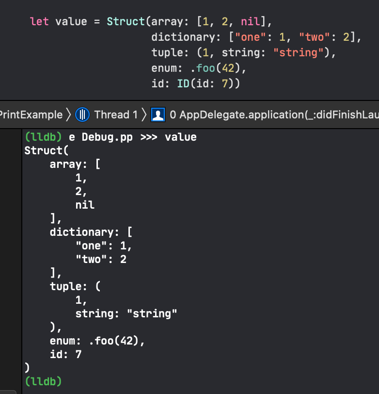

# SwiftPrettyPrint


[](https://cocoapods.org/pods/SwiftPrettyPrint)
[](https://github.com/Carthage/Carthage)

[](https://github.com/YusukeHosonuma/SwiftPrettyPrint/blob/master/LICENSE)
[](https://twitter.com/tobi462)


Pretty print for debug that readable output than `print()` and `debugPrint()`.



## Motivation 💪

`print` and `debugPrint` is implemented by standard library of Swift.
But both function is not readable output string to console sometime.
This is especially when using struct as ValueObject.

For example:

```swift
struct Dog {
    var id: DogId
    var price: Price
    var name: String?
}

struct DogId {
    var rawValue: String
}

struct Price {
    var rawValue: Double
}

let dog = Dog(id: DogId(rawValue: "pochi"), price: Price(rawValue: 10.0), name: "ポチ")

print(dog)
// => Dog(id: SwiftPrettyPrint.DogId(rawValue: "pochi"), price: SwiftPrettyPrint.Price(rawValue: 10.0), name: Optional("ポチ"))

debugPrint(dog)
// => SwiftPrettyPrint.Dog(id: SwiftPrettyPrint.DogId(rawValue: "pochi"), price: SwiftPrettyPrint.Price(rawValue: 10.0), name: Optional("ポチ"))
```

This output is enough information for debug,
but not human-readable for when forcusing on the values.

With SwiftPrittyPrint it looks like this:

```swift
Debug.p(dog)
// => Dog(id: "pochi", price: 10.0, name: "ポチ")

Debug.p(dog, debug: true)
// => Dog(id: DogId(rawValue: "pochi"), price: Price(10.0), name: Optional("ポチ"))
```

## Installation

### CocoaPods (Recommended)

```ruby
pod "SwiftPrettyPrint", :configuration => "Debug" # enabled on `Debug` build only
```

Example app is in [Example](./Example).

### Carthage

```text
github "YusukeHosonuma/SwiftPrettyPrint"
```

### Swift Package Manager

```swift
dependencies: [
    .package(url: "https://github.com/YusukeHosonuma/SwiftPrettyPrint.git", from: "0.0.2"),
]
```

or add from Xcode 10+.

## Recommend Settings 📝

If you don't want to write import statement, I recommended to create `Debug.swift` in each targets.

```swift
// Note:
// Enabled on `debug` configuration only.
// Therefore compile error in `release` build when remaining `Debug` in sources.

#if canImport(SwiftPrettyPrint)
    import SwiftPrettyPrint
    typealias Debug = SwiftPrettyPrint.Debug
#endif
```

This can be not need to `import` as follows:

```swift
let dog = Dog(id: DogId(rawValue: "pochi"), price: Price(rawValue: 10.0), name: "ポチ")
Debug.p(dog)
```

## Develoopment

Require:

- Xcode 11.3
- [pre-commit](https://github.com/pre-commit/pre-commit-hooks)

Execute `make setup` to install development tools to system (not include Xcode 11.3).

```text
$ make help
setup      Install requirement development tools to system and setup (not include Xcode 11.3)
build      swift - build
test       swift - test
xcode      swift - generate xcode project
format     format sources by SwiftFormat
lint       cocoapods - lint podspec
release    cocoapods - release
info       cocoapods - show trunk information
```
