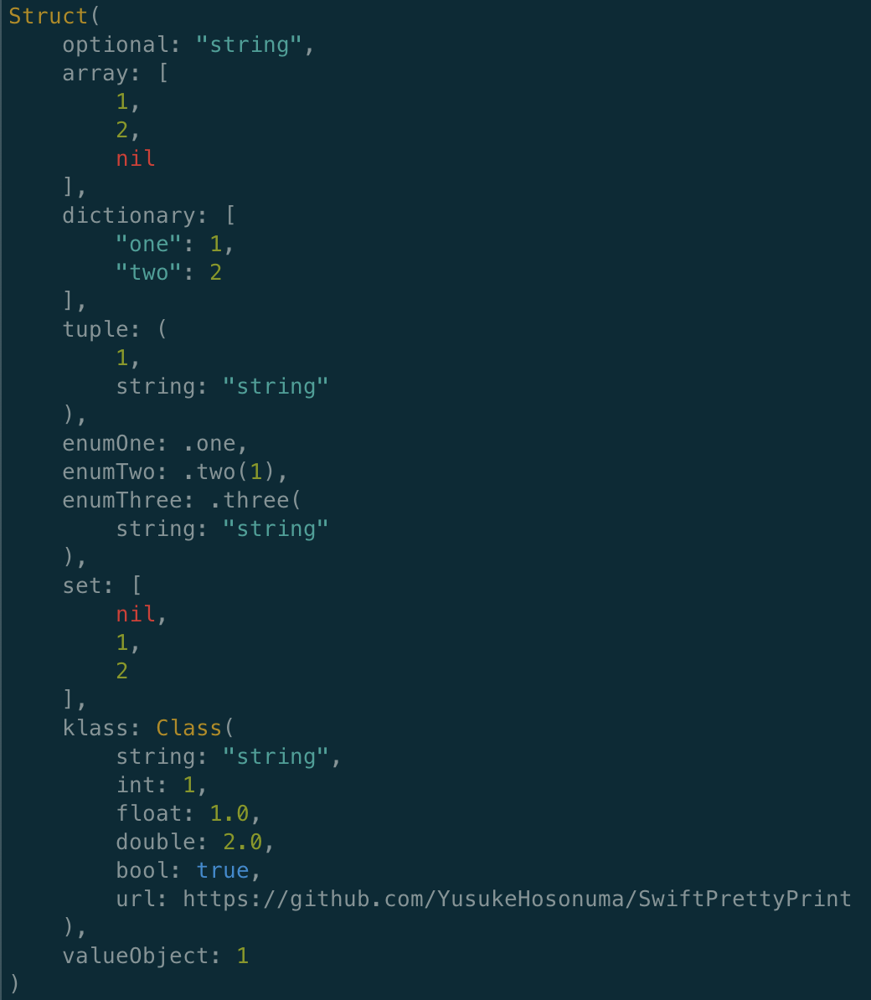

# SwiftPrettyPrint


[](https://cocoapods.org/pods/SwiftPrettyPrint)
[](https://github.com/Carthage/Carthage)

[](https://github.com/YusukeHosonuma/SwiftPrettyPrint/blob/main/LICENSE)
[](https://twitter.com/tobi462)


SwiftPrettyPrint gives **Human-readable outputs** than `print()`, `debugPrint()` and `dump()` in Swift standard library.


## Features 🚀

 - Style
   - ✅ Single-line
   - ✅ Multi-line
 - Integration
   - ✅ LLDB
   - ✅ Terminal
   - ✅ Combine
   - [ ] RxSwift
 - Package Manager
   - ✅ Swift Package Manager
   - ✅ CocoaPods
   - ✅ Carthage
 - OS Support
   - ✅ Apple platforms
   - ✅ Linux
   - [ ] Windows

## Table of Contents 📖

 - [Motivation 💪](#Motivation-💪)
   - [Use Standard library of Swift](#Use-Standard-library-of-Swift)
   - [Use SwiftPrettyPrint](#Use-SwiftPrettyPrint)
 - [API](#API)
 - [Operator-based API](#Operator-based-API)
 - [Format options](#Format-options)
   - [Indent size](#Indent-size)
   - [Prefix and Label](#Prefix-and-Label)
   - [Outputting in Console.app](#Outputting-in-Console.app)
 - [Integrations 🔌](#Integrations-🔌)
   - [LLDB](#LLDB)
   - [Terminal](#Terminal)
   - [Combine](#Combine)
 - [Installation](#Installation)
   - [CocoaPods (Recommended)](#CocoaPods-(Recommended))
   - [Carthage](#Carthage)
   - [Swift Package Manager](#Swift-Package-Manager)
 - [Recommend Settings 📝](#Recommend-Settings-📝)
 - [Requirements](#Requirements)
 - [Development](#Development)
 - [Author](#Author)

## Motivation 💪

The `print()`, `debugPrint()` and `dump()` are implemented in standard library of Swift.
But outputs of these functions are difficult to read sometimes.

For example, there are following types and a value:

```swift
enum Enum {
    case foo(Int)
}

struct ID {
    let id: Int
}

struct Struct {
    var array: [Int?]
    var dictionary: [String: Int]
    var tuple: (Int, string: String)
    var `enum`: Enum
    var id: ID
}

let value = Struct(array: [1, 2, nil],
                   dictionary: ["one": 1, "two": 2],
                   tuple: (1, string: "string"),
                   enum: .foo(42),
                   id: ID(id: 7))
```

### Use Standard library of Swift

When you use the standard library, you get the following results.

```swift
print(value)
// Struct(array: [Optional(1), Optional(2), nil], dictionary: ["one": 1, "two": 2], tuple: (1, string: "string"), enum: SwiftPrettyPrintExample.Enum.foo(42), id: SwiftPrettyPrintExample.ID(id: 7))

debugPrint(value)
// SwiftPrettyPrintExample.Struct(array: [Optional(1), Optional(2), nil], dictionary: ["one": 1, "two": 2], tuple: (1, string: "string"), enum: SwiftPrettyPrintExample.Enum.foo(42), id: SwiftPrettyPrintExample.ID(id: 7))

dump(value)
// ▿ SwiftPrettyPrintExample.Struct
//   ▿ array: 3 elements
//     ▿ Optional(1)
//       - some: 1
//     ▿ Optional(2)
//       - some: 2
//     - nil
//   ▿ dictionary: 2 key/value pairs
//     ▿ (2 elements)
//       - key: "one"
//       - value: 1
//     ▿ (2 elements)
//       - key: "two"
//       - value: 2
//   ▿ tuple: (2 elements)
//     - .0: 1
//     - string: "string"
//   ▿ enum: SwiftPrettyPrintExample.Enum.foo
//     - foo: 42
//   ▿ id: SwiftPrettyPrintExample.ID
//     - id: 7
```

These outputs are enough informations for debugging, but **not human-readable** outputs.

### Use SwiftPrettyPrint

With the SwiftPrittyPrint, it looks like this:

```swift
Pretty.print(value)
// Struct(array: [1, 2, nil], dictionary: ["one": 1, "two": 2], tuple: (1, string: "string"), enum: .foo(42), id: 7)

Pretty.prettyPrint(value)
// Struct(
//     array: [
//         1,
//         2,
//         nil
//     ],
//     dictionary: [
//         "one": 1,
//         "two": 2
//     ],
//     tuple: (
//         1,
//         string: "string"
//     ),
//     enum: .foo(42),
//     id: 7
// )
```

Of course, we also can use the SwiftPrettyPrint with **LLDB**.
(By using [LLDB integration](#LLDB), you can use it with shorter keywords such as `_p` and `_pp`)

```text
(lldb) e Pretty.prettyPrint(value)
Struct(
    array: [
        1,
        2,
        nil
    ],
    dictionary: [
        "one": 1,
        "two": 2
    ],
    tuple: (
        1,
        string: "string"
    ),
    enum: .foo(42),
    id: 7
)
```

## API

SwiftPrettyPrint has four basic functions as follows:

- `print(label: String?, _ targets: Any..., separator: String, option: Pretty.Option)`
  - print in **one-line**.
- `prettyPrint(label: String?, _ targets: Any..., separator: String, option: Pretty.Option)`
  - print in **multiline**.
- `printDebug(label: String?, _ targets: Any..., separator: String, option: Pretty.Option)`
  - print in **one-line** with **type-information**.
- `prettyPrintDebug(label: String?, _ targets: Any..., separator: String, option: Pretty.Option)`
  - print in **multiline** with **type-information**.

The only required argument is `targets`, it can usually be described as follows.

```swift
let array: [URL?] = [
    URL(string: "https://github.com/YusukeHosonuma/SwiftPrettyPrint"),
    nil
]

Pretty.print(array)
// => [https://github.com/YusukeHosonuma/SwiftPrettyPrint, nil]

Pretty.prettyPrint(array)
// =>
// [
//     https://github.com/YusukeHosonuma/SwiftPrettyPrint,
//     nil
// ]

Pretty.printDebug(array)
// => [Optional(URL("https://github.com/YusukeHosonuma/SwiftPrettyPrint")), nil]

Pretty.prettyPrintDebug(array)
// =>
// [
//     Optional(URL("https://github.com/YusukeHosonuma/SwiftPrettyPrint")),
//     nil
// ]
```

## Operator-based API

You can use operator based alias APIs that like Ruby.

This isn't needed to enclose in parentheses that convenient to long expression.

```swift
p >>> 42
// => 42

p >>> 42 + 2 * 4 // It can also be applied to expression
// => 50

p >>> String(string.reversed()).hasSuffix("eH")
// => true

pp >>> ["Hello", "World"]
// =>
// [
//     "Hello",
//     "World"
// ]
```

| Operator syntax | Equatable to                 |
|-----------------|------------------------------|
| `p >>> 42`      | `Pretty.print(42)`            |
| `pp >>> 42`     | `Pretty.prettyPrint(42)`      |
| `pd >>> 42`     | `Pretty.printDebug(42)`       |
| `ppd >>> 42`    | `Pretty.prettyPrintDebug(42)` |

## Format options

You can configure format options, shared or passed by arguments.

### Indent size

You can specify indent size in pretty-print like following:

```swift
// Global option
Pretty.sharedOption = Pretty.Option(indentSize: 4)

let value = (bool: true, array: ["Hello", "World"])

// Use `sharedOption`
Pretty.prettyPrint(value)
// =>
// (
//     bool: true,
//     array: [
//         "Hello",
//         "World"
//     ]
// )

// Use option that is passed by argument
Pretty.prettyPrint(value, option: Pretty.Option(prefix: nil, indentSize: 2))
// =>
// (
//   bool: true,
//   array: [
//     "Hello",
//     "World"
//   ]
// )
```

### Prefix and Label

You can specify a global prefix and a label (e.g. variable name) like following:

```swift
Pretty.sharedOption = Pretty.Option(prefix: "[DEBUG]")

let array = ["Hello", "World"]

Pretty.print(label: "array", array)
// => [DEBUG] array: ["Hello", "World"]

Pretty.p("array") >>> array
// => [DEBUG] array: ["Hello", "World"]
```

### Outputting in Console.app

Applying `.osLog` to `Option.outputStrategy` makes the output be shown in `Console.app`:

> 

The outputs in xcode-debug-console will be the following.

```swift
Debug.sharedOption = Debug.Option(outputStrategy: .osLog)

let dog = Dog(id: DogId(rawValue: "pochi"), price: Price(rawValue: 10.0), name: "ポチ")

Debug.print(dog)
// => 2020-04-02 11:51:10.766231+0900 SwiftPrettyPrintExample[41397:2843004] Dog(id: "pochi", price: 10.0, name: "ポチ")
```

## Integrations 🔌

### LLDB

Please copy and add follows to your `~/.lldbinit` (please create the file if the file doesn't exist):

```text
command regex _p  's/(.+)/e -l swift -o -- var option = Pretty.sharedOption; option.prefix = nil; Pretty.print(%1, option: option)/'
command regex _pp 's/(.+)/e -l swift -o -- var option = Pretty.sharedOption; option.prefix = nil; Pretty.prettyPrint(%1, option: option)/'
```

or install via [lowmad](https://github.com/bangerang/lowmad):

```text
$ lowmad install https://github.com/YusukeHosonuma/SwiftPrettyPrint.git
```

**Note:**
If you already installed 1.1.0 or older version of SwiftPrettyPrint via [lowmad](https://github.com/bangerang/lowmad), please remove scripts manually before update. (e.g. `rm /usr/local/lib/lowmad/commands/YusukeHosonuma-SwiftPrettyPrint/swift_pretty_print.py`)

This lets you to use the lldb command in debug console as follows:

```text
(lldb) _p dog
Dog(id: "pochi", price: 10.0, name: "ポチ")

(lldb) _pp dog
Dog(
    id: "pochi",
    price: 10.0,
    name: "ポチ"
)
```

### Terminal

SwiftPrettyPrint outputs log files to the following files automatically when running **iOS Simulator** or **macOS**.

 - /tmp/SwiftPrettyPrint/output.log
 - /tmp/SwiftPrettyPrint/output-colored.log (ANSI colored)

So you can read them from other tools such as `tail` or `grep` and others.

```text
$ tail -F /tmp/SwiftPrettyPrint/output-colored.log
```

A `output-colored.log` is ANSI colorlized, so this looks beautiful on terminal.



#### Customize

You can customize terminal ANSI colors by `Debug.Option.theme` property like as follows.

```swift
let theme = ColorTheme(
    type: { $0.green().bold() },
    nil: { $0.yellow() },
    bool: { $0.yellow() },
    string: { $0.blue() },
    number: { $0.cyan() },
    url: { $0.underline() }
)

Debug.sharedOption = Debug.Option(theme: theme)
```

ANSI colors can be easily specified using [ColorizeSwift](https://github.com/mtynior/ColorizeSwift).

#### Did you create a beautiful theme?

Please add new theme to [ColorTheme.swift](https://github.com/YusukeHosonuma/SwiftPrettyPrint/tree/main/Sources/Core/Color/ColorTheme.swift) and create PR.

```diff
public struct ColorTheme {
    ...    
+   public static let themeName = ColorTheme(
+       type: { ... },
+       nil: { ... },
+       bool: { ... },
+       string: { ... },
+       number: { ... },
+       url: { ... }
+   )
    
    public var type: (String) -> String
    public var `nil`: (String) -> String
    ...
```

Thanks!

### Combine

You can use `prettyPrint()` operator in Combine framework.

```swift
[[1, 2], [3, 4]]
    .publisher
    .prettyPrint("🍌")
    .sink { _ in }
    .store(in: &cancellables)
// =>
// 🍌: receive subscription: [[1, 2], [3, 4]]
// 🍌: request unlimited
// 🍌: receive value:
// [
//     1,
//     2
// ]
// 🍌: receive value:
// [
//     3,
//     4
// ]
// 🍌: receive finished
```

You can specify `when:` and `format:`.

```swift
[[1, 2], [3, 4]]
    .publisher
    .prettyPrint("🍌", when: [.output, .completion], format: .singleline)
    .sink { _ in }
    .store(in: &cancellables)
// =>
// 🍌: receive value: [1, 2]
// 🍌: receive value: [3, 4]
// 🍌: receive finished
```

You can use alias API `p()` and `pp()` too.

```swift
[[1, 2], [3, 4]]
    .publisher
    .p("🍎")  // Output as single-line
    .pp("🍊") // Output as multiline
    .sink { _ in }
    .store(in: &cancellables)
```

## Installation

### CocoaPods (Recommended)

```ruby
pod "SwiftPrettyPrint", "~> 1.2.0", :configuration => "Debug" # enabled on `Debug` build only
```

The example app is [here](./Example).

### Carthage

```text
github "YusukeHosonuma/SwiftPrettyPrint"
```

### Swift Package Manager

Add the following line to the dependencies in your `Package.swift` file:

```swift
.package(url: "https://github.com/YusukeHosonuma/SwiftPrettyPrint.git", .upToNextMajor(from: "1.2.0"))
```

Finally, include "SwiftPrettyPrint" as a dependency for your any target:

```swift
let package = Package(
    // name, platforms, products, etc.
    dependencies: [
        .package(url: "https://github.com/YusukeHosonuma/SwiftPrettyPrint.git", .upToNextMajor(from: "1.2.0")),
        // other dependencies
    ],
    targets: [
        .target(name: "<your-target-name>", dependencies: ["SwiftPrettyPrint"]),
        // other targets
    ]
)
```

Alternatively, use Xcode integration. This function is available since Xcode 10.

## Recommend Settings 📝

If you don't want to write an `import` statement when debugging.

We recommend to create `Debug.swift` and to declaration any type as `typealias` like following:

```swift
// Debug.swift
#if canImport(SwiftPrettyPrint)
    import SwiftPrettyPrint
    typealias Debug = SwiftPrettyPrint.Pretty // You can use short alias such as `D` too.
#endif
```

You don't need to write a `import` statement in each sources any longer.

```swift
// AnySource.swift
Debug.print(42)
Debug.prettyPrint(label: "array", array)
```

Note:
This can't be used to the operator-based API such as `p >>>`. (This is a Swift language's limitation)

## Requirements

- Xcode 11.3+ (Swift 5.1+)
- Platforms
  - iOS 10.0+
  - macOS 10.12+
  - watchOS 5.0+
  - tvOS 12.0+

## Development

Require:

- Xcode 11.3.1
  - Note: But run tests are failed on macOS 11.0.1, please use `make test` or latest version of Xcode to run unit tests.
- [pre-commit](https://github.com/pre-commit/pre-commit-hooks)

Execute `make setup` to install development tools to system (not include Xcode 11.3).

```text
$ make help
setup      Install requirement development tools to system and setup (not include Xcode 11.3)
build      swift - build
test       swift - test
xcode      swift - generate xcode project
format     format sources by SwiftFormat
lint       cocoapods - lint podspec
release    cocoapods - release
info       cocoapods - show trunk information
```

## Author

Developed by **Penginmura**.

- [Yusuke Hosonuma](https://github.com/YusukeHosonuma)
- [sahara-ooga](https://github.com/sahara-ooga)
- [Kazutoshi Miyasaka](https://github.com/po-miyasaka)
